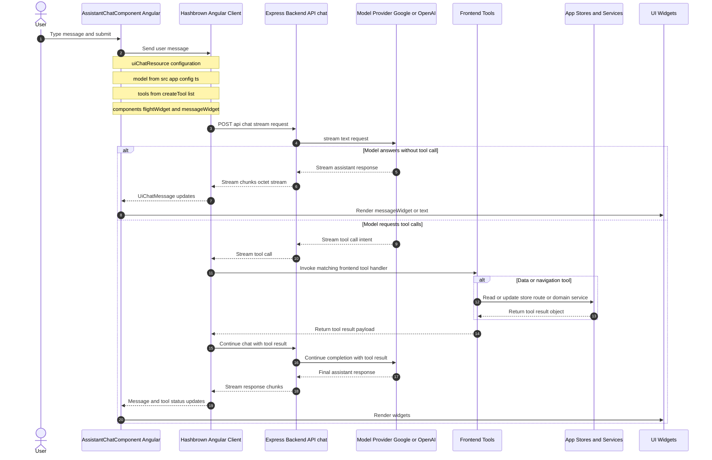
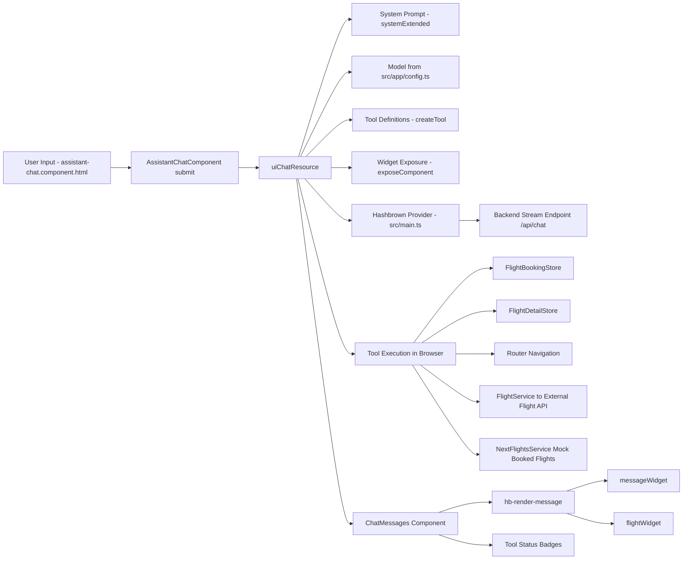
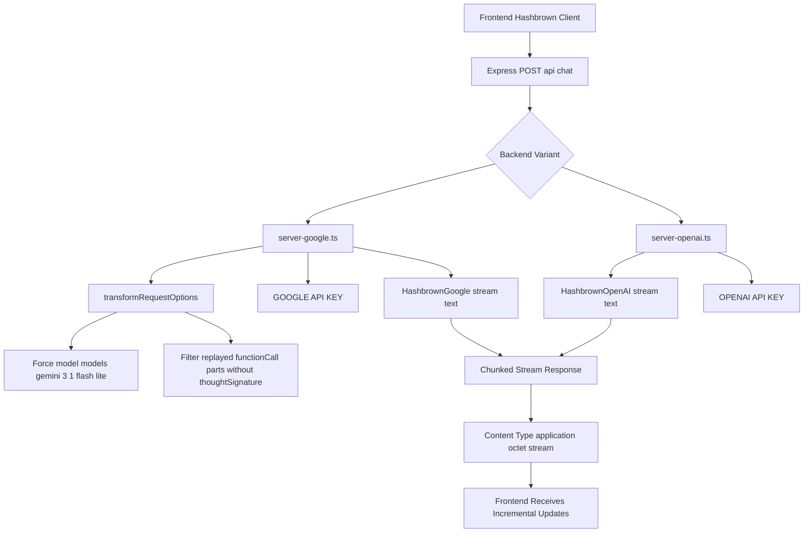

# Assistant Chat Architecture

This document explains how the assistant chat works end-to-end in this project.

## 1) End-to-end sequence

## 2) Frontend architecture

## 3) Backend architecture

## 4) Tool definition layer

All assistant tools are defined on the frontend as Hashbrown tools and passed into uiChatResource.

Current active tool list in AssistantChatComponent:

1. findFlights
2. getLoadedFlights
3. toggleFlightSelection
4. getCurrentBasket
5. displayFlightDetail
6. getBookedFlights
7. updateFlight
8. getCurrentRoute
9. getCurrentFlight
10. loadFlightsForRoutes

Important behavior notes:

- Several tools use withToolResultGuard(...) to enforce non-null return values and prevent repeated tool-call loops.
- Some tools are state readers (for example getLoadedFlights, getCurrentRoute).
- Some tools mutate app state (for example toggleFlightSelection, updateFlight).
- Some tools trigger navigation (for example findFlights, displayFlightDetail).
- Some tools call domain services for data loading (for example loadFlightsForRoutes via FlightService).

## 5) Configuration and model usage

Configuration influences assistant behavior at multiple levels:

1. Frontend model selection:
- src/app/config.ts sets model used by uiChatResource.

2. Frontend chat transport:
- src/main.ts provideHashbrown sets chat baseUrl to http://localhost:3000/api/chat.
- emulateStructuredOutput is enabled.

3. Backend provider and keys:
- server-google.ts requires GOOGLE_API_KEY.
- server-openai.ts requires OPENAI_API_KEY.
- npm start:backend runs server-google.ts by default.

4. Domain API base URL for flight data:
- src/assets/config.json provides baseUrl for FlightService through ConfigService.

## 6) Practical runtime picture

At runtime, there are two independent but connected pipelines:

1. Chat pipeline:
- User prompt -> uiChatResource -> backend /api/chat -> LLM stream -> UI message rendering.

2. Domain action pipeline:
- LLM tool decision -> frontend tool handler -> store/service/router updates -> tool result -> LLM follow-up response -> widget rendering.

This split is why the assistant can both answer in natural language and actively operate the app (search, navigate, select, update) in one conversation.
