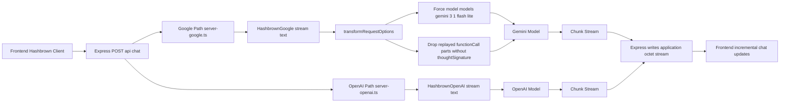
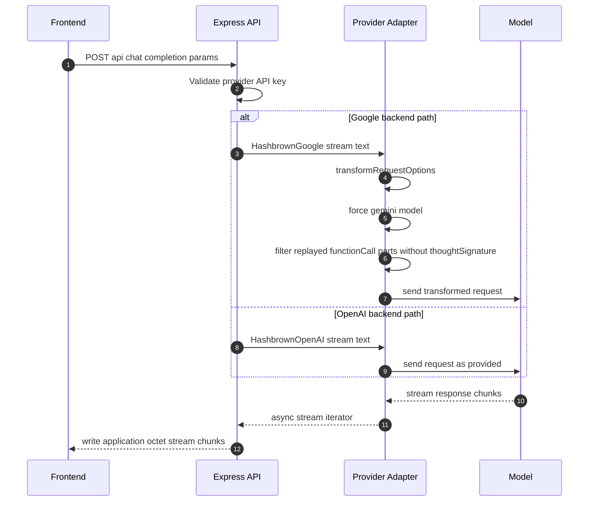

# Backend Flow Comparison: Google vs OpenAI

This document compares both backend provider paths implemented in this repository.

## Compared files

- server-google.ts
- server-openai.ts

## Side-by-side architecture

## Unified sequence with provider branch

## Key differences

| Topic | Google path | OpenAI path |
|---|---|---|
| Server entry file | server-google.ts | server-openai.ts |
| Required env var | GOOGLE_API_KEY | OPENAI_API_KEY |
| Provider SDK | @hashbrownai/google | @hashbrownai/openai |
| Backend request transform | Yes | No |
| Model override in backend | Yes, models/gemini-3.1-flash-lite | No explicit override in server |
| Replay function-call compatibility filter | Yes | No |
| Response streaming to frontend | Yes | Yes |
| Response content type | application/octet-stream | application/octet-stream |

## Shared behavior

1. Both expose POST /api/chat in Express.
2. Both accept chat completion parameters from the frontend.
3. Both call provider stream.text and forward chunks incrementally.
4. Both return a streamed octet response for incremental UI updates.

## When to choose which path

1. Choose Google path when you need the Gemini-specific compatibility transform already implemented in this project.
2. Choose OpenAI path when you want a direct pass-through request flow without backend request mutation.
