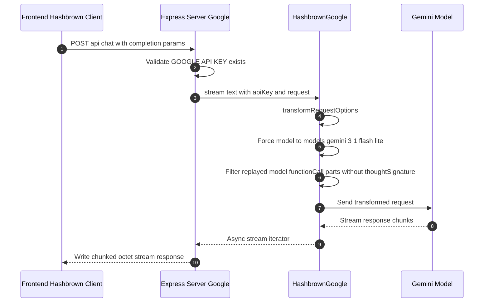
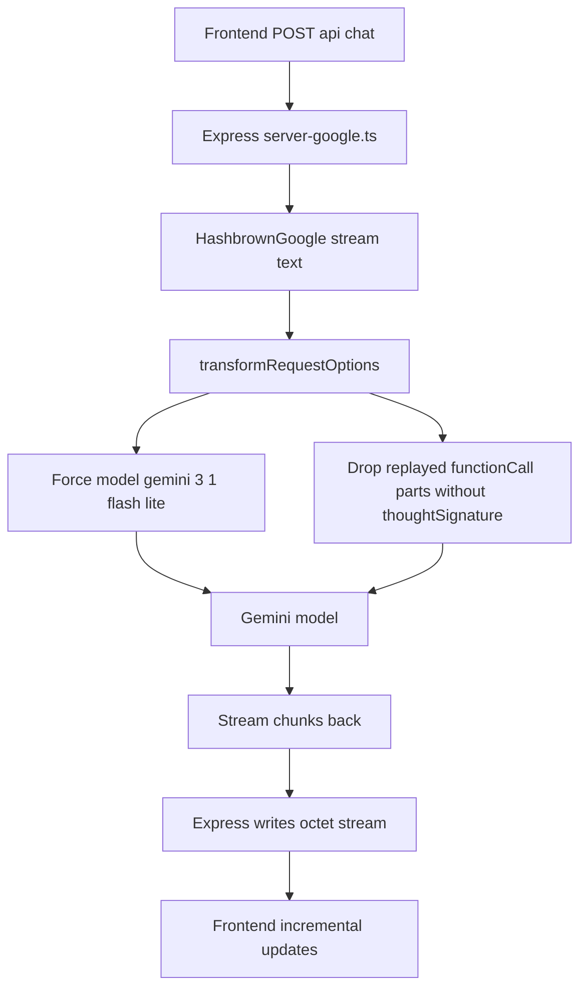

# Backend Flow: Google Model

This document describes the backend request flow when using the Google provider in this project.

## Scope

- Server file: server-google.ts
- Endpoint: POST /api/chat
- Provider SDK: @hashbrownai/google
- Runtime key: GOOGLE_API_KEY
- Effective model set in backend transform: models/gemini-3.1-flash-lite

## Sequence

## Processing Stages

1. Input parsing
- Express receives JSON body and treats it as Chat.Api.CompletionCreateParams.

2. Provider call
- The server calls HashbrownGoogle.stream.text with apiKey and request.

3. Request transformation
- transformRequestOptions is used to normalize outgoing options.
- The model is explicitly overridden in the backend to models/gemini-3.1-flash-lite.
- Model role contents are filtered so replayed functionCall parts without thoughtSignature are dropped.

4. Streaming response
- The server sets content type to application/octet-stream.
- It forwards each provider chunk to the frontend stream as it arrives.

## Why the Google-specific filter exists

The server removes replayed functionCall parts that do not include thoughtSignature to avoid Gemini validation failures during tool-call replay. Tool responses are still preserved and the conversation can continue.

## Minimal flowchart

