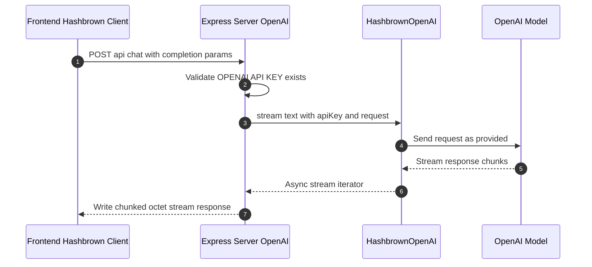
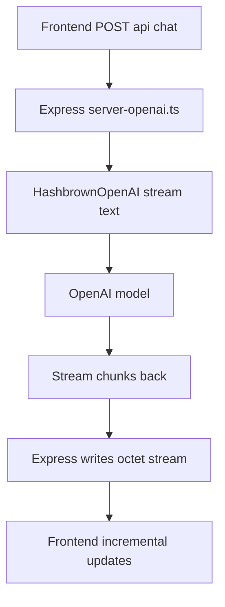

# Backend Flow: OpenAI Model

This document describes the backend request flow when using the OpenAI provider in this branch.

## Scope

- Server file: server-openai.ts
- Endpoint: POST /api/chat
- Provider SDK: @hashbrownai/openai
- Runtime key: OPENAI_API_KEY
- Model source: incoming completion request from frontend

## Sequence

## Processing Stages

1. Input parsing
- Express receives JSON body and treats it as Chat.Api.CompletionCreateParams.

2. Provider call
- The server calls HashbrownOpenAI.stream.text with apiKey and request.
- No backend request transformation is applied in this variant.

3. Streaming response
- The server sets content type to application/octet-stream.
- It forwards each provider chunk to the frontend stream as it arrives.

## Minimal flowchart

